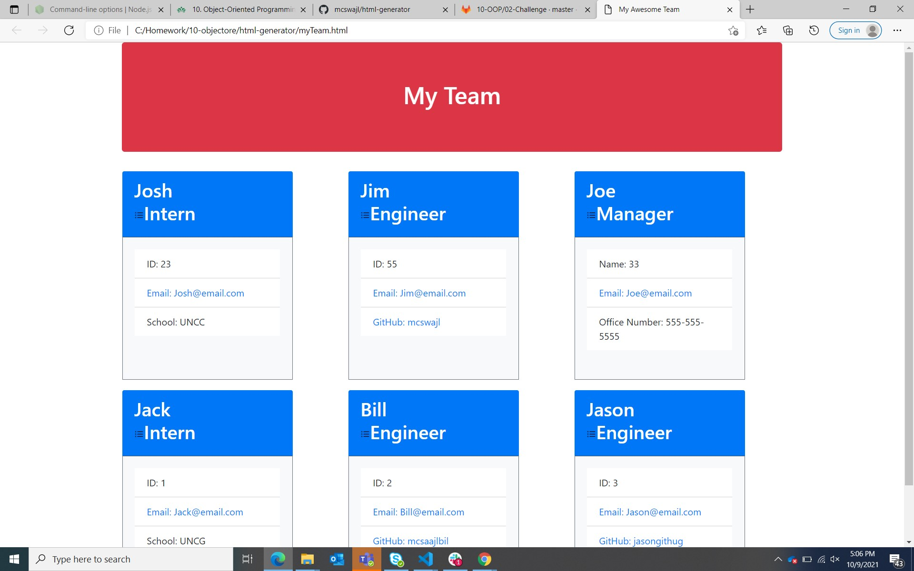

## My Team Page Summary
My command line application generates a tema page of software engineers and other member types. User is prompted for information about the team members then returns an html page with all team user information.

## Instructions
Your challenge is to build a Node.js command-line application that takes in information about employees on a software engineering team and generates an HTML webpage that displays summaries for each person. Because testing is key to making code maintainable, you’ll also write unit tests for each part of your code and ensure that it passes all of them.

Because this application won’t be deployed, you’ll also need to provide a link to a walkthrough video that demonstrates its functionality and all of the tests passing. You’ll need to submit a link to the video **and** add it to the README of your project.

## Aplication Summary 

npm install has to be run for my package.json file to work.

Jest for running the tests, run inquirer for collecting user input.

There are also unit tests to help you build the classes necessary.

It is recommended that you follow this workflow:

Testing
Pass a single test case and the repeat until all four test have run.
All four of my test passed!

Below is the example directory structure that the READme challenge provided:

.
├── __tests__/             //jest tests
│   ├── Employee.test.js
│   ├── Engineer.test.js
│   ├── Intern.test.js
│   └── Manager.test.js
├── dist/                  // rendered output (HTML) and CSS style sheet      
├── lib/                   // classes
├── src/                   // template helper code 
├── .gitignore             // indicates which folders and files Git should ignore
├── index.js               // runs the application
└── package.json           

## Methods
My methods are simple and they can be found in ./_test_.

## Employees
My employee types all inherit some methods and properties from a base class of Employee.

## Minimum Requirements
**Important**: Make sure that you remove `dist` from the `.gitignore` file so that Git will track this folder and include it when you push up to your application's repository.

The application must have these classes: `Employee`, `Manager`, `Engineer`, and `Intern`. The tests for these classes (in the `_tests_` directory) **must all pass**.

The first class is an Employee parent class with the following properties and methods:

* `name`

* `id`

* `email`

* `getName()`

* `getId()`

* `getEmail()`

* `getRole()`   // Returns 'Employee'

The other three classes will extend `Employee`.

In addition to `Employee`'s properties and methods, `Manager` will also have:

* `officeNumber`

* `getRole()`   // Overridden to return 'Manager'

In addition to `Employee`'s properties and methods, `Engineer` will also have:

* `github`  // GitHub username

* `getGithub()`

* `getRole()`   // Overridden to return 'Engineer'

In addition to `Employee`'s properties and methods, `Intern` will also have:

* `school`

* `getSchool()`

* `getRole()`   // Overridden to return 'Intern'

Finally, although it’s not a requirement, you should consider adding validation to ensure that user input provided is in the proper expected format.

## Screenshot (taken during development)
Screenshot of my website

## Review

You are required to submit the following for review:

* A walkthrough video demonstrating the functionality of the application and passing tests.

* A sample HTML file generated using your application.

* The URL of the GitHub repository. Give the repository a unique name and include a README describing the project.

## GitHub Link
GitHub URL:  https://github.com/mcswajl/html-generator

Joshua McSwain
joshua.mcswain@mecklenburgcountync.gov
UNCC coding bootcamp 2021